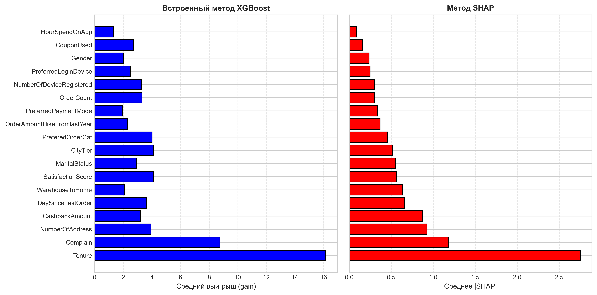
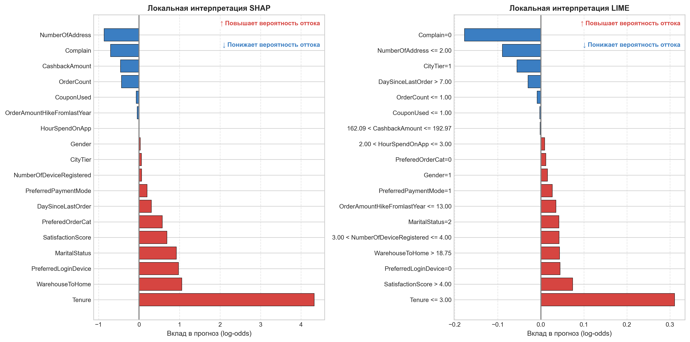
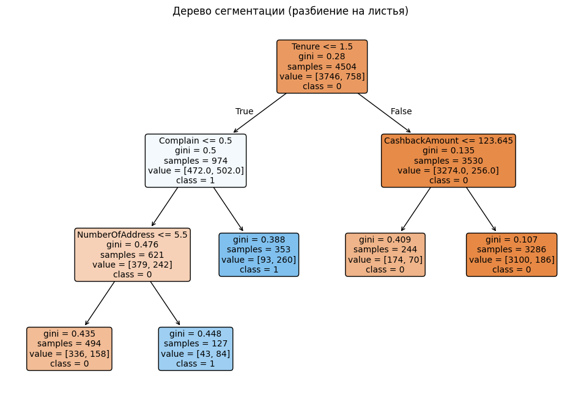
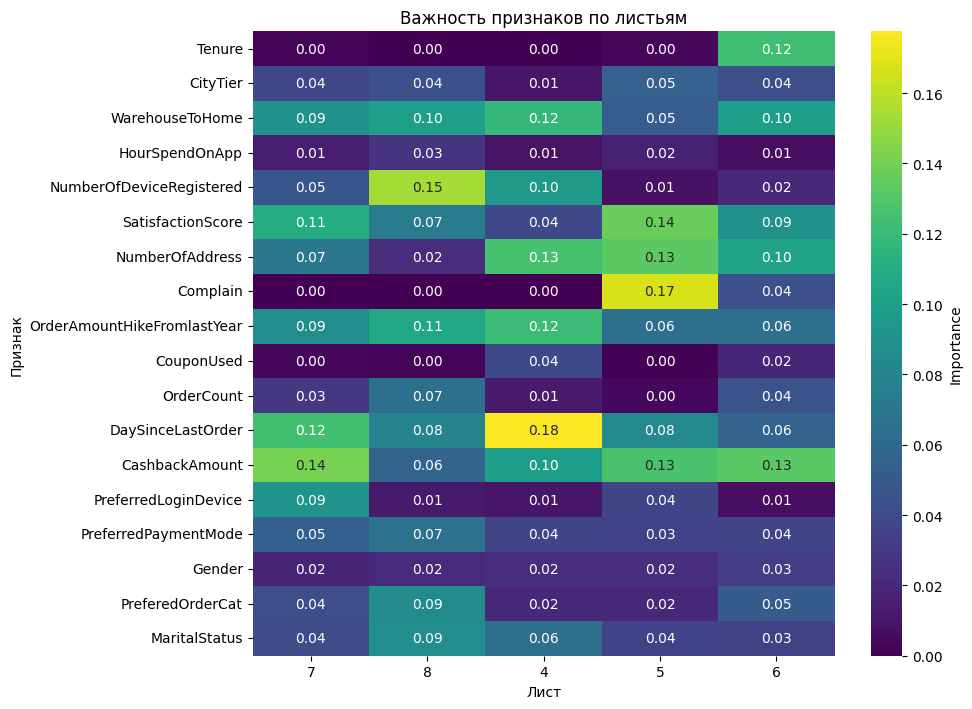
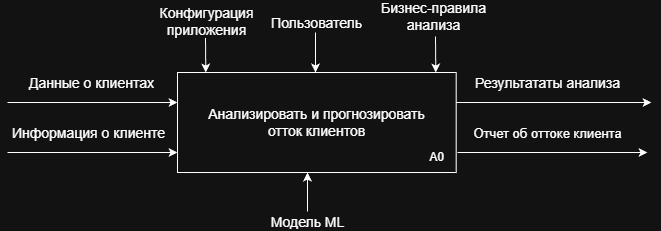
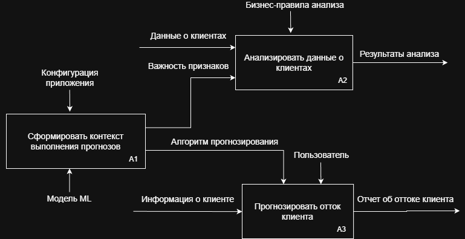

# Анализ и прогнозирование оттока клиентов в сфере электронной коммерции с использованием методов машинного обучения

[**Выпускная квалификационная работа**](docs/ВКРБ_Бабошин_НА_2026.pdf)

[Презентация](docs/Презентация_БабошинНА.pdf)

**Автор:** Бабошин Никита Андреевич (гр. 6401-010302D)

## Актуальность, цель и задачи работы

**Актуальность**: прогнозирование оттока методами ML необходимо для оптимизации маркетинговых бюджетов и удержания клиентов в электронной коммерции [1].

**Цель работы**: разработать и экспериментально обосновать методологию прогнозирования оттока клиентов электронной коммерции на основе моделей машинного обучения.

**Задачи**:
- изучение теоретических основ анализа и прогнозирования оттока клиентов в сфере электронной коммерции;
- экспериментальное исследование моделей машинного обучения для прогнозирования оттока клиентов;
- разработка веб-приложения для поддержки принятия решений.

## Математическая постановка задачи

С математической точки зрения задача прогнозирования оттока формулируется как задача бинарной классификации с оценкой вероятности:

*   **Множество клиентов:** $C = \{c_1, c_2, \dots, c_N\}$
*   **Признаковое описание:** каждый клиент характеризуется вектором признаков $x_i \in \mathbb{R}^d$
*   **Целевая переменная (бинарная метка):** 
    *   $y_i = 1$, если клиент $c_i$ склонен к оттоку (уходит);
    *   $y_i = 0$, если клиент $c_i$ остается лояльным.
*   **Функция предсказания:** необходимо построить отображение $f: \mathbb{R}^d \rightarrow [0, 1]$, которое оценивает вероятность оттока:
    $$p_i = P(y_i = 1 | x_i) = f(x_i), \quad p_i \in [0, 1]$$
*   **Обучающая выборка:** набор размеченных пар $\{(x_i, y_i)\}_{i=1}^N$.

## Исходные данные
В работе использовались два независимых набора данных, что позволило обеспечить робастность моделей:
1. **Статические профили клиентов** (5 630 наблюдений): демографические, транзакционные и поведенческие признаки (пол, статус, история заказов, кэшбэк, время в приложении и др.) [2].
2. **Логи маркетинговой платформы REES46** (112 610 наблюдений): данные сгруппированы по расширенной RFM+ схеме, специфичной для E-commerce [3].

## Проблема дисбаланса классов

В задачах прогнозирования оттока клиентов распределение целевой переменной, как правило, характеризуется выраженным дисбалансом – доля лояльных пользователей существенно превышает долю ушедших. Стандартные алгоритмы машинного обучения, оптимизирующие общую долю верных ответов, демонстрируют системное смещение предсказаний в сторону мажоритарного класса.

> **В работе данная проблема решается на уровне моделей путем настройки весов классов.**

## Предобработка данных

* Очистка и фильтрация данных от ошибок трекинга.
    * Обработка пропущенных значений
    * Корректировка целевой переменной
    * Фильтрация по максимальной длительности сессии
    * Проверка конверсии (причинно-следственной связи транзакций и просмотров)
    * Логарифмическое преобразование (если среднее и медиана существенно расходились)
    * Коррекция выбросов на основе межквартильного размаха (IQR)
* Кодирование категориальных признаков и масштабирование числовых.
* Отбор признаков с учетом мультиколлинеарности.
* Разделение на train/test в соотношении 80/20.

Распределение клиентов во втором наборе данных до и после очистка и фильтрации данных от ошибок трекинга:

## Методы машинного обучения

В рамках данной работы к решению задачи прогнозирования оттока клиентов был привлечён широкий спектр алгоритмов машинного обучения – от линейных моделей до глубоких нейронных сетей и специализированных гибридных архитектур. Выбор модельного ряда обоснован необходимостью, с одной стороны, установить базовый уровень качества с помощью простых интерпретируемых методов, а с другой – исследовать способность более сложных ансамблевых и нейросетевых подходов улавливать нелинейные зависимости и сложные взаимодействия признаков. В состав исследуемых моделей вошли: логистическая регрессия, дерево решений, случайный лес, XGBoost, многослойный персептрон, TabNet [4], а также гибридная Logit Leaf Model [5] с возможностью варьирования типа модели в листьях. Все модели были реализованы в экосистеме Python с использованием библиотек scikit-learn, XGBoost, PyTorch и pytorch-tabnet, что обеспечило унифицированный программный интерфейс и корректное сравнение результатов.

## Подбор гиперпараметров

Подбор гиперпараметров в работе осуществлялся методом исчерпывающего сетчатого поиска (`GridSearchCV`) с 5-кратной кросс-валидацией, где целевой метрикой оптимизации выступал F1-Score для учета дисбаланса классов. Для статических данных применялось стандартное случайное разбиение на фолды, тогда как для учета временной зависимости во втором наборе данных использовался метод `TimeSeriesSplit`, сохраняющий хронологический порядок и предотвращающий утечку информации из будущего. В результате для каждой из восьми исследованных моделей были определены оптимальные комбинации параметров, обеспечившие наилучшую обобщающую способность перед финальным тестированием на отложенной выборке.

## Эксперименты с гибридным алгоритмом

**Результаты замены логистической регрессии в листьях на градиентный бустинг**

- [На первом наборе данных](research/leaf_model_one.ipynb)

| Модель в листьях | Accuracy | Precision | Recall | F1-Score | ROC-AUC |
| :--- | :---: | :---: | :---: | :---: | :---: |
| Логистическая регрессия | 0,9094 | 0,8188 | 0,5947 | 0,6890 | 0,9077 |
| Градиентный бустинг | 0,9885 | 0,9683 | 0,9632 | 0,9657 | 0,9984 |

- [На втором наборе данных](research/leaf_model_two.ipynb)

**Дополнительно**: добавление отбора признаков в листьях по F-критерию Фишера 

| Модель в листьях | Отбор признаков | Accuracy | Precision | Recall | F1-Score | ROC-AUC |
| :--- | :---: | :---: | :---: | :---: | :---: | :---: |
| Логистическая регрессия | Нет | 0,8631 | 0,9178 | 0,7218 | 0,8081 | 0,9458 |
| Логистическая регрессия | Есть | 0,8673 | 0,9073 | 0,7436 | 0,8173 | 0,9426 |
| Градиентный бустинг | Нет | 0,8792 | 0,8618 | 0,8305 | 0,8458 | 0,9501 |
| Градиентный бустинг | Есть | 0,8723 | 0,8202 | 0,8710 | 0,8449 | 0,9446 |

> **Вывод**: Градиентный бустинг в листьях заметно улучшил качество прогнозирования. Отбор признаков показал неоднозначный результат.

## Сравнение качества моделей

- [На первом наборе данных](research/analys_one.ipynb)
- [На втором наборе данных](research/analys_two.ipynb)

Для принятия обоснованного решения о выборе финальной модели, учитывающего многокритериальность задачи прогнозирования оттока, был разработан и рассчитан **Композитный показатель качества (CQS — Composite Quality Score)**. Данный метрический агрегат объединяет ключевые показатели эффективности в единую скалярную оценку, что позволяет объективно сравнить разнородные алгоритмы:

$$
CQS = w_1 \cdot F1\text{-}Score_{avg} + w_2 \cdot PR\text{-}AUC_{avg} + w_3 \cdot ROC\text{-}AUC_{avg} + w_4 \cdot Accuracy_{avg}
$$

Весовые коэффициенты ($w_1=0.4, w_2=0.3, w_3=0.2, w_4=0.1$) были выбраны исходя из приоритетов предметной области E-commerce, где критически важными являются баланс между точностью и полнотой ($F1\text{-}Score$), а также качество ранжирования вероятностей ($PR\text{-}AUC$ и $ROC\text{-}AUC$).

| Модель | F1-Scoreavg | PR-AUCavg | ROC-AUCavg | Accuracyavg | **CQS** |
| :--- | :---: | :---: | :---: | :---: | :---: |
| **XGBoost** | 0.9086 | 0.9647 | 0.9737 | 0.9359 | **0.9412** |
| **GB Leaf Model** | 0.9053 | 0.9594 | 0.9737 | 0.9304 | **0.9377** |
| **Random Forest** | 0.8959 | 0.9598 | 0.9734 | 0.9292 | **0.9339** |
| TabNet | 0.8723 | 0.9410 | 0.9667 | 0.9186 | **0.9164** |
| MLP | 0.8334 | 0.9437 | 0.9642 | 0.8848 | **0.8978** |
| Decision Tree | 0.8444 | 0.8992 | 0.9188 | 0.8922 | **0.8805** |
| Logit Leaf Model | 0.7532 | 0.8433 | 0.9252 | 0.8884 | **0.8281** |
| Logistic Regression | 0.6697 | 0.7801 | 0.8955 | 0.7871 | **0.7597** |

> **Вывод**: Наилучшее качество прогнозов демонстрирует XGBoost, чуть уступают ему гибридный алгоритм GB Leaf Model и случайный лес.

## Интерпретация прогнозов

**Первый набор данных**

Глобальная интерпретация

Локальная интерпретация

Итерпретация по сегментам гибридного алгоритма

- Дерево решений

- Тепловая карта важности признаков

**Второй набор данных**

Агрегированный анализ важности признаков по расширенной RFM схеме (глобальная интерпретация)

| Группа | Встроенный метод XGBoost | | | Метод SHAP | | |
| :--- | :---: | :---: | :---: | :---: | :---: | :---: |
| | **Среднее** | **Сумма** | **%** | **Среднее** | **Сумма** | **%** |
| **Recency** | 0,0036 | 0,0250 | 2,50 | 0,1645 | 1,1512 | 10,87 |
| **Frequency** | 0,0361 | 0,7952 | 79,51 | 0,3251 | 7,1528 | 67,56 |
| **Monetary** | 0,0041 | 0,0655 | 6,55 | 0,0525 | 0,8403 | 7,94 |
| **Preference** | 0,0032 | 0,0731 | 7,31 | 0,0308 | 0,7082 | 6,69 |
| **Others** | 0,0032 | 0,0413 | 4,13 | 0,0566 | 0,7356 | 6,95 |

## Разработка веб-приложения

[Ссылка на веб-приложение](https://predictor-churn-e-commerce.streamlit.app/)

**Технологический стек**: Streamlit, XGBoost, SHAP, Joblib, scikit-learn, Plotly, Pandas

**Функциональное моделирование архитектуры**

- Контекстная диаграмма

- Декомпозиция контекстной диаграммы

## Список использованных источников

1. Gold, C. Fighting Churn with Data: The science and strategy of customer retention / Carl S. Gold. – Shelter Island : Manning Publications, 2020. – 504 p. – ISBN 978-1-61729-652-9.
2. Verma, A. Ecommerce Customer Churn Analysis and Prediction / ankitverma2010 // Kaggle : [сайт]. – 2020.
3. Fridrich, M. E-commerce churn dataset - REES46 / fridrichmrtn // Kaggle : [сайт]. – 2023
4. De Caigny, A. A new hybrid classification algorithm for customer churn prediction based on logistic regression and decision trees / A. De Caigny, K. Coussement, K. W. De Bock. – DOI: 10.1016/j.ejor.2018.02.009 // European Journal of Operational Research. – 2018. – Vol. 269, Issue 2. – P. 760–772.
5. Arik, S. Ö. TabNet: Attentive Interpretable Tabular Learning / S. Ö. Arik, T. Pfister. – DOI: 10.1609/aaai.v35i8.16826 // Proceedings of the AAAI Conference on Artificial Intelligence. – 2021. – Vol. 35, Issue 8. – P. 6679–6687.